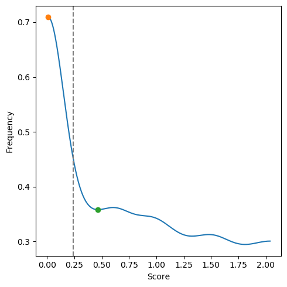
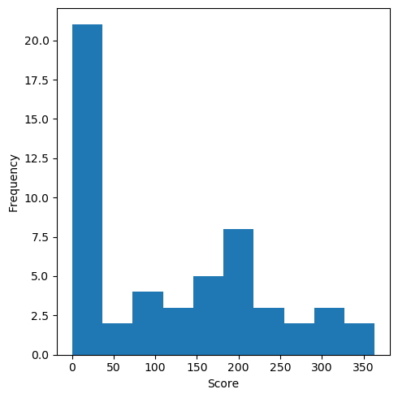
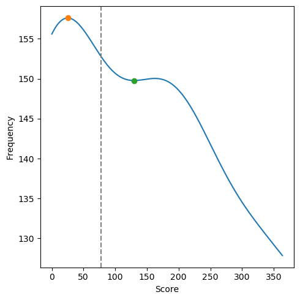

First run
=========

HGTector works out-of-the-box.

In this minimum setting, the program does not need a sequence aligner, or a local sequence database, or a taxonomy system, or any super computing hardware. It will take care of everything by calling a remote server (by default the NCBI BLAST server). It does not even need input data --- as long as you provide a list of sequence IDs which can be looked up from the remote database.

A small example is provided in the subdirectory [example](../example). The input file [gsul.txt](../example/gsul.txt) contains NCBI accessions of 100 protein-coding genes subsampled from the genome of [_Galdieria sulphuraria_](https://en.wikipedia.org/wiki/Galdieria_sulphuraria), a unicellular red alga found in hot sulphur springs. The genome of _G. sulphuraria_ and its HGT pattern was investigated in this paper:

> Schönknecht, G. _et al_. [Gene transfer from bacteria and archaea facilitated evolution of an extremophilic eukaryote](https://science.sciencemag.org/content/339/6124/1207.long). _Science_ **339**, 1207-10 (2013)

Let's analyze this small example using HGTector.


## Search

First run the `search` command to do a batch homology search for the input proteins:

```bash
hgtector search -i gsul.txt -o .
```

(If you are curious why the command is so simple, that's because lots of automations take place under the hood. More controls will be explained later.)

The program will start to pull sequences and their taxonomy from NCBI GenBank, and submit them to the NCBI BLASTp server to search against the non-redundant protein database (**nr**).

This isn't going to be fast, since the NCBI server is being used by many and, one (human or program) should expect delays. But if everything is smooth, you should be able to get the result in a few hours. If not (due to network issues ~~or your patience~~), you can find the example [output](../example/output) which I generated on 2019-10-16.

Basically, you will get [gsul.tsv](../example/output/gsul.tsv), a collection of BLAST hit tables of the 100 proteins, together with a tiny taxonomy database ([nodes.dmp](../example/output/nodes.dmp) and [names.dmp](../example/output/names.dmp)) which summarizes the organisms behind the hits.


## Analyze

Then run the `analyze` command to predict HGTs based on the search result.

```bash
hgtector analyze -i gsul.tsv -o .
```

It will generate the final output in a few seconds: a [list](../example/output/hgts/gsul.txt) of putatively HGT-derived genes (yah!), plus a few tables and plots. This is it!

You may close the browser tab now; though I would encourage you to continue to read the content below, which briefly explains what's actually going on.


## More details

Let's follow the screen output:

```
...
Auto-inferring plausible taxIds for input genomes based on taxonomy of search results...
  gsul: 130081 (Galdieria sulphuraria) (covering 100% best hits).
```

Here, the program is trying to guess the taxonomy of the input genome, which, to some extent represents its position in **vertical** evolution. One can explore **horizontal** evolution ONLY AFTER vertical evolution is already defined. In this case, as you can see, the guess is correct (TaxID: [130081](https://www.ncbi.nlm.nih.gov/Taxonomy/Browser/wwwtax.cgi?mode=Info&id=130081), taxon name: _Galdieria sulphuraria_).

```
...
Auto-inferred self group:
  130081 (species Galdieria sulphuraria)
Self group has 1 taxa.
Auto-inferred close group:
  2797 (class Bangiophyceae)
Close group has 31 taxa.
```

Here, the program is dividing all taxa mentioned in the search result into three groups: "**self**", "**close**", and "**distal**", based on the taxonomic distance from the input genome. The "self" group is species _Galdieria sulphuraria_. This is reasonable since there is only one input genome.

Meanwhile, the program assigns class Bangiophyceae (TaxID: [2797](https://www.ncbi.nlm.nih.gov/Taxonomy/Browser/wwwtax.cgi?mode=Info&id=2797)) as the "close" group, and reports that it has 31 taxa (excluding _Galdieria sulphuraria_). Hits from the "close" group are considered plausible enough for a vertical transmission scenario.

Finally, all other taxa are considered as the "distal" group. For a vertically-transmitted gene, the distal hits should typically occur _after_ the close hits due to lower sequence similarity. If they are overrepresented and with high bit scores, one has reason to suspect that they were horizontally acquired.

The output file, [scores.tsv](../example/output/scores.tsv), lists the scores (sum of weighted bit scores) of each of the three groups of each gene. The larger the score is, the higher in frequency and similarity are the hits under the corresponding group.

```
...
Calculating thresholds for clustering...
Close group:
  1.000: n/a
  ...
  0.298: 0.237601 - 67.92%
  Auto-determined bandwidth: 0.297635.
  Threshold: 0.237601.
```

Meanwhile, two graphs have been generated. [close.hist.png](../example/output/close.hist.png) is a histogram of the distribution of "close" scores of all genes.


[close.kde.png](../example/output/close.kde.png) is the density function of this distribution.



Here, the program attempts to divide genes into two clusters based on their "close" weight. The cluster at the lower end is composed of genes without many "close" hits, a sign implicating non-vertical evolutionary history. The other cluster at the higher end and with a wider range are those with a fair amount of "close" hits. 

The statistical approach for clustering "close" scores is **kernel density estimation (KDE)**. The program implements an algorithm which automatically determines the most suitable "**bandwidth**" (i.e., how smooth the density curve is) for the goal of this analysis. In this case, the calculated bandwidth is 0.297635, based on which the program calculates the **threshold** (indicated by the grey vertical line) for separating the low-end cluster from the remaining data: 0.237601.

```
Distal group:
  1.000: n/a
  ...
  0.546: 77.5005 - 43.40%
  Auto-determined bandwidth: 0.545559.
  Threshold: 77.5005.
```

The same procedure is applied to the "distal" scores.




```
Labeling cluster... done.
  Total predicted HGTs: 14.
```

Now the program proposes a candidate list of genes that are susceptible to HGT. The criteria for assigning a gene to this list is: 1) its "close" score is in the lower cluster (atypical); 2) its "distal" score is NOT in the lower cluster (typical).

```
Refining cluster... done.
  Total predicted HGTs after refinement: 13.
```

Starting from this candidate list, the program performs a refinement in the 2D space. This process involves calculating the "**silhouette scores**", a metric which measures how confident a data point is assigned to the current cluster in the whole dataset. The higher the better. The program drops low-score genes from the candidate list, and the refined list will be the final result.

The 13 predicted HGT-derived genes, together with their silhouette scores, are listed in [hgts/gsul.txt](../example/output/hgts/gsul.txt). Meanwhile, a scatter plot showing "distal" score vs. "close" score is generated. The yellow dots represent the predicted genes. As you can see, they are all located at the right boundary of the plot, meaning they have no to few "close" hits, but a decent amount of "distal" hits.


## Aftermath

Let's do a sanity check on the result. The original paper, [Schönknecht _et al_. (2013)](https://science.sciencemag.org/content/339/6124/1207.long) reported that two genes encoding for ArsB (arsenite efflux protein) (`EME29520` and `EME26816`) were horizontally acquired (see Figure 3 of the paper). You should find that the two genes are among the 13 predicted genes in this small and quick analysis.

Next, one may examine these predicted genes and their hit tables. This will provide clues for further inferring the putative donors of the genes. For example, in the hit table of `EME29520`, there are multiple hits from beta- and gammaproteobacteria...

Please note two limitations of this small test: 1) Only 100 genes are sampled, which are but a small subset of the _G. sulphuraria_ genome. The statistical power is thus limited. 2) Because _G. sulphuraria_ is a unicellular eukaryote, and there are not many closely related eukaryotic genomes sequenced, the frequency of "close" hits are lower (and more difficult to cluster) than what you will typically see if your research interests are bacteria and archaea.

Next, please read the [second run](2ndrun.md) for more detailed demonstration and discussion of the analysis.
