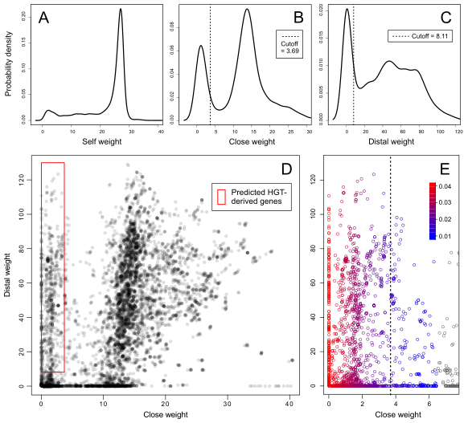
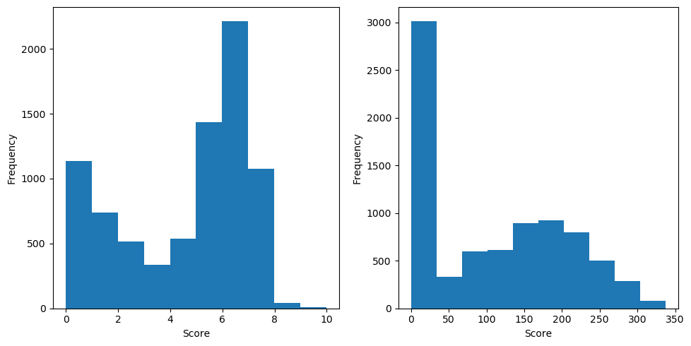
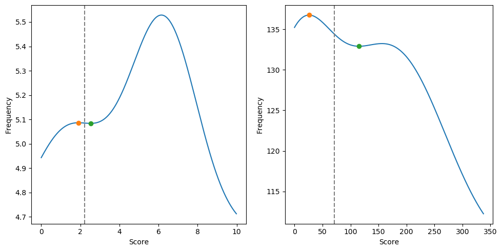
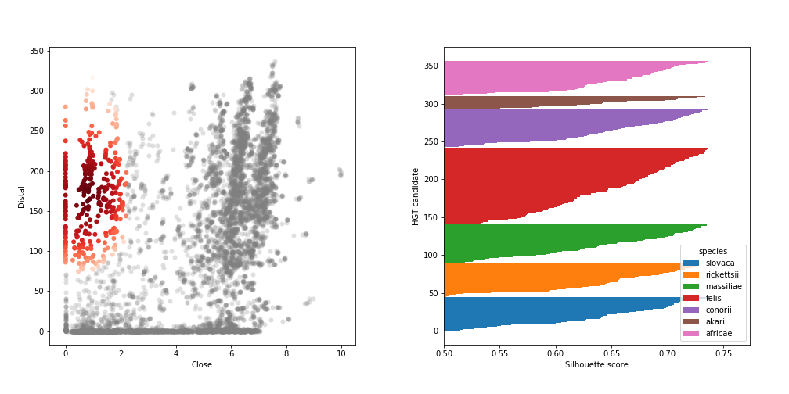
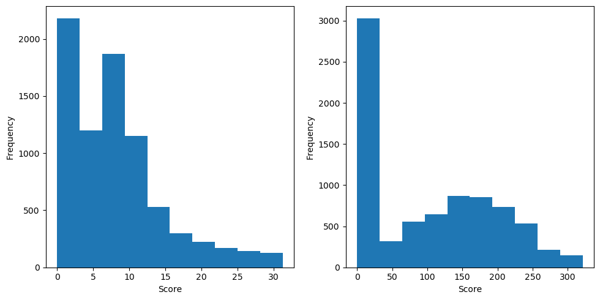
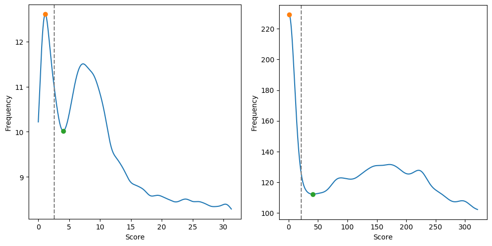
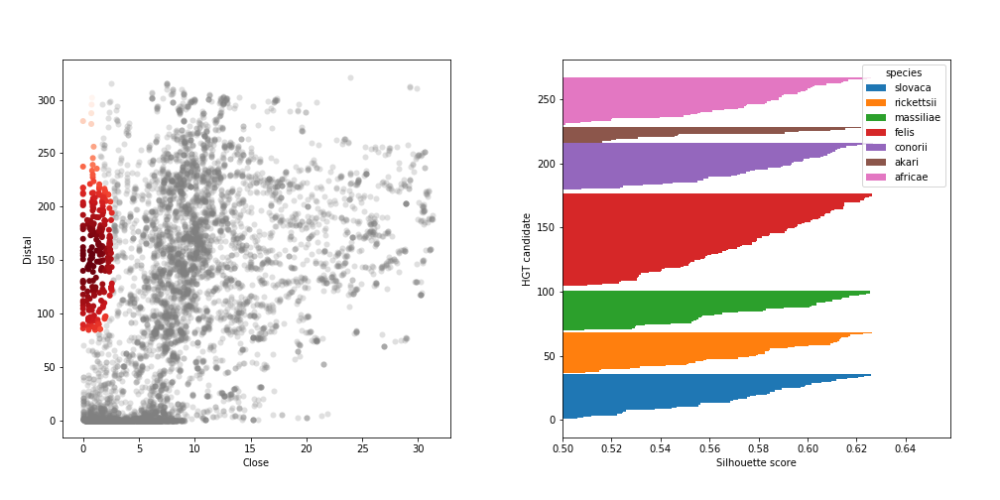

Real runs
=========

The two previous demos ([1st run](1strun.md) and [2nd run](2ndrun.md)) are small-scale, limited in either input protein set or reference database, respectively. Now let's look at a realistic case. In this page we will replicate the analysis described in the original HGTector paper (Fig. 3 of [Zhu et al., 2014](https://bmcgenomics.biomedcentral.com/articles/10.1186/1471-2164-15-717)).



This analysis involves seven _Rickettsia_ species under the [spotted fever](https://en.wikipedia.org/wiki/Spotted_fever) group (TaxID: [114277](https://www.ncbi.nlm.nih.gov/Taxonomy/Browser/wwwtax.cgi?mode=Info&id=114277)). In the 2014 paper, we searched against the NCBI nr database as of 2012. Here we will see what we get using the [default database](https://www.dropbox.com/s/qdnfgzdcjadlm4i/hgtdb_20191021.tar.xz?dl=0) constructed in Oct 2019.

This page won't have much text, since most ingredients of HGTector were already discussed in the two previous tutorials. I will let the figures explain themselves.

## Input data

Species | TaxID | Genome
--- | --- | --- | --- | --- | --- | --- | ---
_R. africae_ | 35788 | [GCF_000023005.1](ftp://ftp.ncbi.nlm.nih.gov/genomes/all/GCF/000/023/005/GCF_000023005.1_ASM2300v1/)
_R. akari_ | 786 | [GCF_000018205.1](ftp://ftp.ncbi.nlm.nih.gov/genomes/all/GCF/000/018/205/GCF_000018205.1_ASM1820v1/)
_R. conorii_ | 781 | [GCF_000007025.1](ftp://ftp.ncbi.nlm.nih.gov/genomes/all/GCF/000/007/025/GCF_000007025.1_ASM702v1/)
_R. felis_ | 42862 | [GCF_000012145.1](ftp://ftp.ncbi.nlm.nih.gov/genomes/all/GCF/000/012/145/GCF_000012145.1_ASM1214v1/)
_R. massiliae_ | 35791 | [GCF_000016625.1](ftp://ftp.ncbi.nlm.nih.gov/genomes/all/GCF/000/016/625/GCF_000016625.1_ASM1662v1/)
_R. rickettsii_ | 783 | [GCF_000018225.1](ftp://ftp.ncbi.nlm.nih.gov/genomes/all/GCF/000/018/225/GCF_000018225.1_ASM1822v1/)
_R. slovaca_ | 35794 | [GCF_000237845.1](ftp://ftp.ncbi.nlm.nih.gov/genomes/all/GCF/000/237/845/GCF_000237845.1_ASM23784v1/)


## Default workflow

Just run the default workflow:

```bash
hgtector search -i input -o search -m diamond -p 16 -d hgtdb/diamond/db -t hgtdb/taxdump
```

```bash
hgtector analyze -i search -o analyze -t hgtdb/taxdump
```

The automated workflow correctly figured that all seven genomes belong to the **spotted fever group** (even though it is not a standard taxonomic rank!), and assigns it as the "self" group. It then moves up one level to genus _Rickettsia_, and let it be the "close" group.

In this realistic analysis, both "close" and "distal" groups are sufficiently sampled, and the distributions of scores are apparently bimodal.

(Left panel is "close", right panel is "distal", same below)



The default method for kernel bandwidth selection quickly finds the "atypical" cluster in each group.



Finally it predicts a total of 357 putatively HGT-derived genes, out of 8,559 genes in the seven genomes. As the scatter plot (left) shows, it is a pretty conservative prediction. If one wants more candidates, the two parameters `--noise` and `--silhouette` may be set to zero to include genes in the "grey zone".

The predicted HGT activity is differential across species (right). For example [_Rickettsia felis_](https://en.wikipedia.org/wiki/Rickettsia_felis) appears to have many more HGT-derived genes than [_Rickettsia akari_](https://en.wikipedia.org/wiki/Rickettsia_akari).




## Customization

Now we will specify a few parameters to best mimick the 2014 analysis.

```bash
hgtector analyze -i search -o analyze -t hgtdb/taxdump \
  --bandwidth grid --self-tax 114277 --close-tax 766
```

Here the "self" group is still the spotted fever group (the same as HGTector's inference), but the "close" group is raised to order Rickettsiales (TaxID: [766](https://www.ncbi.nlm.nih.gov/Taxonomy/Browser/wwwtax.cgi?mode=Info&id=766)). The enlarged "close" group allows for more robust clustering. Meanwhile, the kernel bandwidth is to be optimized using grid search with cross validation (this is new).

This protocol predicts 268 HGT-derived genes.






